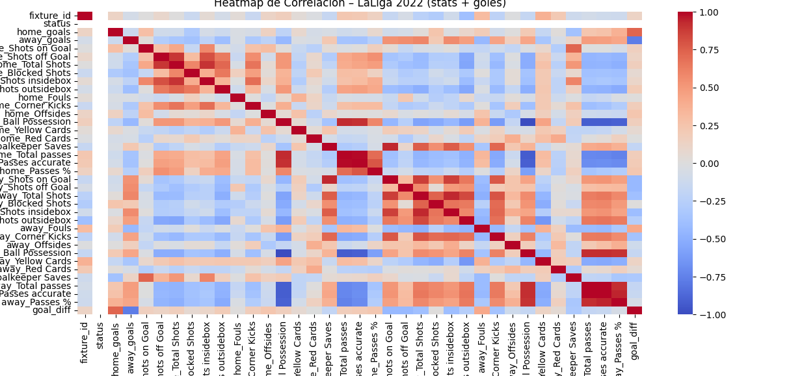
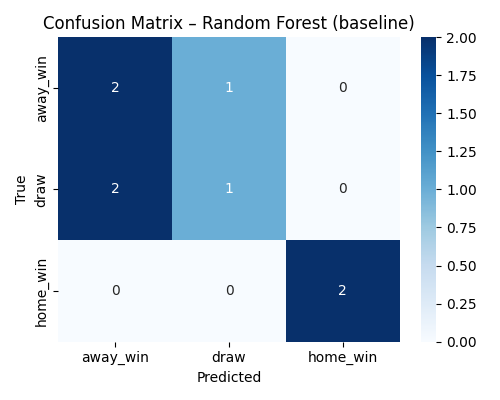
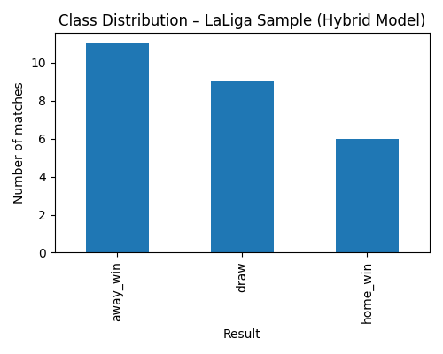
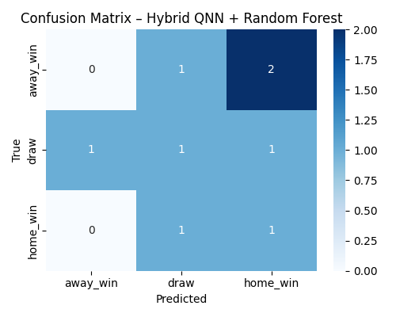

# Predictive Analytics on LaLiga Data Using Classical & Quantum Machine Learning

## Summary

This project implements a complete codebase for football data analysis using the API-Football API to extract LaLiga match information, process it, clean it, and analyze it with professional Data Analytics methodologies. It includes fixture downloading, advanced statistics extraction, dataset cleaning, exploratory data analysis (EDA), and preparation for hybrid predictive models that combine classical techniques (Random Forest) and quantum methods (Quantum Neural Networks – QNN). The goal is to build a solid foundation of real-world data that allows for:

- Understanding relevant patterns within matches (shots, possession, passes, fouls, etc.)
- Identifying correlations between football metrics
- Generating insights that explain team performance
- Preparing a dataset for both classical and quantum predictive models

This repository demonstrates advanced skills in data engineering, API consumption, data cleaning, EDA, feature engineering, classical machine learning, and hybrid quantum models.

### Project Structure

#### 1. Downloading LaLiga Matches from the API-Football API (soccer_api.py)

This module is responsible for connecting to the API-Football API, downloading all completed LaLiga matches for a specific season, and exporting them to a CSV file.

##### Secure API Key Management

from dotenv import load_dotenv
load_dotenv()
API_KEY = os.environ.get("API_FOOTBALL_KEY")

This ensures that the API key is not exposed in the repository, as it is stored in a .env file (included in .gitignore).

##### Main Functions

It queries the endpoint: https://v3.football.api-sports.io/fixtures

* Requests all completed matches (status = FT) from LaLiga (ID = 140).
* Checks for API errors and validates the response.
* Extracts only the essential information:

    - Match ID (fixture_id)
    - Date
    - Round
    - Home and away teams
    - Goals for each team
    - Match status

* Cleans the response to keep only the relevant fields.
* Prints the data in a readable format (json.dumps).
* Returns a list of dictionaries containing the matches.

#### 2. Downloading Advanced Match Statistics (get_statistics.py)

This script downloads the detailed statistics for each match (shots, possession, passes, cards, etc.):

* Reuses the API_KEY defined in soccer_api.py and builds the headers for the API.
* Defines the function get_match_statistics(fixture_id)
* Defines the function download_all_stats(fixture_ids, limit=None)

#### 3. Merging Fixtures and Advanced Statistics (merge_laliga_2022.py)

This script combines two data sources:

* soccer_api_2022.csv → contains general information for each LaLiga 2022 match (teams, date, goals, round, etc.)
* stats_2022_sample.csv → contains detailed match statistics retrieved from the API (shots, possession, passes, cards)

The purpose of this file is to generate a complete dataset for advanced analysis and statistical or machine learning models.

#### 4. Cleaning and Preparing the Final Dataset (cleandata.py)

This script performs the full cleaning process on the combined file laliga_2022_full.csv, leaving it ready for exploratory data analysis (EDA) and model training. The goal is to ensure that the final dataset is consistent, free of duplicates, without repeated columns, correctly typed, and free of problematic values.

This file handles:

* Loading the file laliga_2022_full.csv
* Fixing repeated fields that the Football API sometimes returns
* Removing completely empty rows
* Converting all numerical columns
* Filling missing values
* Converting the date column to datetime format
* Saving the cleaned dataset

#### 5. Exploratory Data Analysis (EDA) of LaLiga 2022 (eda_laliga.py)

This script performs the Exploratory Data Analysis (EDA) of the cleaned dataset laliga_2022_clean.csv, which contains the combined information from:

* Official match results (goals, teams, date, round)
* Advanced team statistics (possession, shots, passes, fouls, cards, etc.)

The goal of this module is to deeply understand team behavior, the relationships between variables, and the characteristics that influence match outcomes.

##### Results (img)

The exploratory analysis reveals relevant statistical patterns in the behavior of home and away teams during the matches analyzed. Below is a summary of the main findings.

a. Dataset composition

* Total matches analyzed: 26
* Total variables: 41

b. Insight

In this sample (only 26 matches), the away team wins almost twice as often as the home team—something that contradicts the typical trend in European football, where home teams usually have an advantage. This may be due to:

* Specific matchdays when strong away teams faced weaker home teams
* Random variation

c. Key descriptive statistics

* Goals
    
    - Average home goals: 0.92
    - Average away goals: 1.31
    - Average goal difference: –0.38

Away teams score more than home teams on average, consistent with the distribution of results.

d. Shots

* Home shots on target: 4.23
* Away shots on target: 4.31
* Total home shots: 13.27
* Total away shots: 10.77

Home teams shoot more, but away teams are more effective at scoring.

e. Possession

* Average home possession: 51.8%
* Average away possession: 48.2%

Home teams control possession, but this does not translate into more goals or wins.

f. Passes

The strongest correlations confirm:

* home_Total passes ↔ home_Passes accurate → 0.99
* away_Total passes ↔ away_Passes accurate → 0.99
* Possession ↔ total/accurate passes → 0.92

Teams with higher possession produce more passes and more accurate passes (expected relationship).

g. Most relevant correlations

Beyond autocorrelations, the highest correlations found were:

* Category 1: Ball control: More possession → more passes → higher accuracy. Correlations above 0.92.
* Category 2: Offensive intensity: Total shots ↔ shots inside the box → 0.93
* Category 3: Attack/defense relationship: Away shots on target ↔ home goalkeeper saves → 0.93

h. Distributions

Histograms showed:

* Most statistics follow moderately normal distributions.
* Fouls, shots, and cards exhibit skewed distributions → some matches were more “intense.”
* Possession and passes cluster around medium–high values with no significant outliers.

#### 6. Baseline Model – Random Forest Classifier (model_baseline.py)

This script implements a classical Machine Learning model based on a Random Forest to predict LaLiga match outcomes using match statistics alone. It serves as an initial reference to later compare against the hybrid quantum–classical model (QNN + Random Forest).

The script performs:

* Loading of the cleaned dataset
* Creation of target variables
* Feature selection
* Target encoding
* Train/test split
* Random Forest model training
* Model evaluation

###### 📊 Baseline Model Visualizations

- Class Distribution

- MConfusion Matrix — Random Forest Baseline

##### Interpretation

The first chart shows the distribution of outcomes in the analyzed LaLiga sample: away-team victories are the most frequent class, followed by draws, while home-team victories are the least common. This indicates a significant class imbalance that diverges from the usual trend in football, where home teams typically have an advantage. This skewed distribution directly influences the behavior of predictive models, as they tend to favor the dominant class (away_win), reducing the model’s ability to generalize properly to underrepresented categories such as home_win.

The confusion matrix of the Random Forest model confirms this effect: the model correctly predicts some away and home victories but repeatedly fails to distinguish between away_win and draw, showing confusion between both classes. Moreover, it does not correctly predict any draws, reflecting the model’s difficulty in handling an intermediate and less consistent category. Overall, the baseline performance is limited by the small sample size and the class imbalance, suggesting the need for rebalance techniques and more complex or hybrid models to improve predictive accuracy.

#### 7. Hybrid Model QNN + Random Forest (model_hybrid_qnn_rf.py)

This script implements a hybrid classification model that combines a variational quantum circuit (QNN) in PennyLane with a classical Random Forest:

* Data loading
* Quantum feature selection and normalization
* QNN definition in PennyLane
* Quantum embedding + Random Forest
* Visualizations (hybrid model results)

###### 📊 Hybrid Model Visualizations

- Class Distribution

- Confusion Matrix - Modelo Hybrid:

##### Interpretation

The first chart shows the distribution of outcomes in the dataset used by the model, where away-team victories (away_win) are the most common, followed by draws, and finally home-team victories (home_win). This distribution reveals an imbalanced dataset, which affects the model’s performance and helps explain why certain classes are harder to predict. The fact that most outcomes are away wins indicates that the set of statistics contains behaviors that favor this type of match, which is important when interpreting any predictive model built on these data.

The confusion matrix shows that the hybrid QNN + Random Forest model achieves strong predictions for the home_win class, but it struggles to correctly distinguish between away_win and draw. For example, several away victories were classified as draws or even as home wins, reflecting both the complexity of the problem and the small size of the dataset. Even so, the model is able to identify interesting patterns in the quantum representation, capturing nonlinear relationships within the statistics. This validates that the hybrid approach adds value, although its performance would improve with a larger and more balanced dataset.